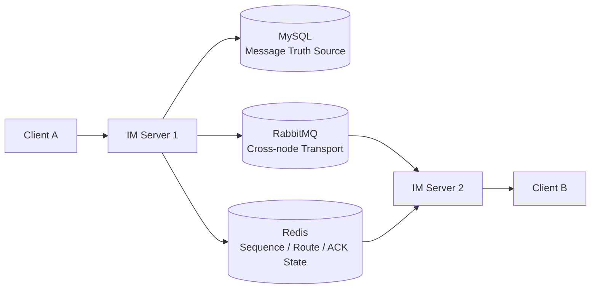
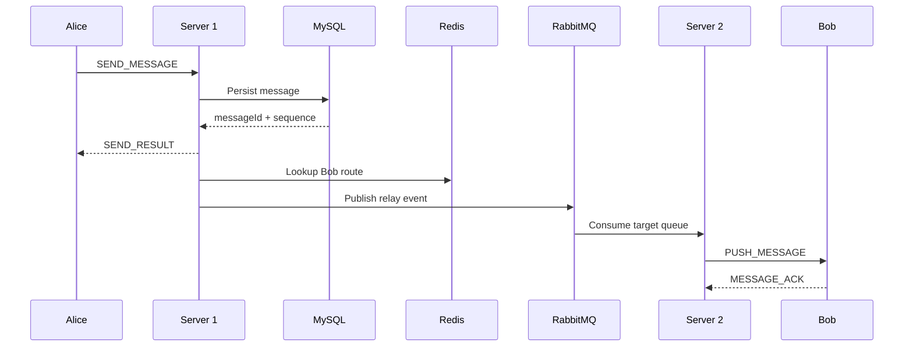

# Distributed IM Server

一个基于 Spring Boot、Netty、WebSocket 和 Protobuf 的分布式即时通讯学习项目。

项目重点不是复杂聊天 UI，而是 IM Server 的核心基础设施：TCP 长连接、JWT/CONNECT
鉴权、多设备 Session、消息持久化、ACK/Retry、Sequence Sync、Redis 在线路由和
RabbitMQ 跨节点实时投递。

本项目研究过 WildfireChat 的长连接、Session、消息投递和同步设计，但没有复制其
源码、包名、MQTT 协议或工程结构。当前实现是独立编写的教学版本。

## Tech Stack

| Layer | Technology |
| --- | --- |
| Backend | Java 17+, Spring Boot 3.3 |
| TCP | Netty 4.1 |
| Browser Transport | Spring WebSocket |
| Protocol | Protobuf over TCP, JSON over WebSocket |
| Persistence | MySQL 8.4 |
| ORM | MyBatis-Plus |
| Cache / Route | Redis 7.4 |
| Cross-Node Transport | RabbitMQ 4.0 |
| Frontend | Vue 3 + TypeScript + Vite |
| Build / Test | Maven, JUnit, Spring Boot Integration Test |
| Infrastructure | Docker Compose |

## Core Features

### Long Connection and Protocol

Netty TCP 默认监听 `9000`，使用长度字段解决 TCP 粘包拆包，再解码自定义
`MessageEnvelope`。浏览器使用 `ws://localhost:8080/ws/im`，通过 JSON 适配器
复用同一套消息业务服务。

```text
LengthFieldBasedFrameDecoder
  -> Protobuf Decoder
  -> IdleStateHandler
  -> AuthHandler
  -> HeartbeatHandler
  -> MessageHandler
  -> SessionCleanupHandler
```

客户端先调用 `POST /api/auth/login` 获取 JWT，再通过 CONNECT 携带
`token + deviceId`。服务端从 JWT 获取 `userId`，不信任客户端提交的 senderId。

### Multi-device Session

Session 以设备为粒度：

```text
userId + deviceId -> Channel
ChannelId -> Session
```

同一设备重复连接时，新连接替换旧连接。断开的旧连接通过 `connectionId`
ownership 校验，不能误删新连接的本地 Session 或 Redis Route。

### Direct and Group Chat

单聊和群聊共享 Conversation、Message、Sequence 和 Delivery 模型。单聊使用规范化
key：

```text
single:min(userIdA, userIdB):max(userIdA, userIdB)
```

`message` 表保存一份业务消息；群聊向在线成员 Fan-out。客户端生成
`clientMessageId`，服务端生成全局唯一 `messageId`，并通过数据库唯一约束实现幂等。

### Reliable Delivery and Recovery

在线投递：

```text
PUSH_MESSAGE -> Pending ACK -> MESSAGE_ACK -> Timeout Retry
```

系统语义是 **At-Least-Once Delivery**，不是 Exactly Once。客户端按 `messageId`
去重，重复 Push 不重复展示，但仍然再次发送 ACK。

消息长期保存于 MySQL。客户端重连后以 Conversation Sequence 调用
`SYNC_REQUEST(lastSequence)`，按 sequence 增量恢复历史消息。

ACK 解决“某个在线设备是否处理了实时 Push”；SYNC 解决断线、离线和实时链路失败后的
历史缺口，两者互补。

### Distributed Route and Cross-node Delivery

Redis 保存：

```text
userId + deviceId -> serverId + connectionId
```

Route 通过 TTL 和 Server Heartbeat 清理脏数据。跨节点发送流程：

```text
Redis Route
  -> RabbitMQ Direct Exchange
  -> Target Server Queue
  -> Local Channel
  -> Device ACK
```

RabbitMQ 只负责跨 IM Server 的实时 Transport，不作为消息事实源，也不用于普通异步
落库或延迟队列。

## Architecture





`SEND_RESULT` 表示消息已被服务端持久化；`MESSAGE_ACK` 表示接收方某个设备已经
接收并处理 Push，二者语义完全不同。

## Reliability Model

### Core Redis Keys

```text
im:seq:{conversationId}
im:route:{userId}:{deviceId}
im:user:devices:{userId}
im:server:registry
im:pending_ack:{userId}:{deviceId}
im:pending_ack_attempt:{userId}:{deviceId}
im:pending_ack_meta:{userId}:{deviceId}
im:pending_ack:index
im:pending_ack:owner:{serverId}
im:relay:delivery:{eventId}
```

### Delivery Identity

- `messageId`：业务消息全局 ID
- `deliveryId`：消息投递到一个设备的稳定 ID
- `eventId`：一次 RabbitMQ transport event 的 ID

相同 `eventId` 的 MQ 重复消费会去重；合法 Retry 使用新的 `eventId`，但保持相同的
`deliveryId`。系统不宣称 Exactly Once。

### Database Model

| Table | Purpose |
| --- | --- |
| `user_account` | 登录用户 |
| `conversation` | DIRECT / GROUP 会话 |
| `conversation_member` | 会话成员 |
| `message` | 消息事实源 |
| `chat_group` | 群资料 |
| `group_member` | 群成员 |

关键约束：

```text
UNIQUE(conversation.biz_key)
UNIQUE(message.message_id)
UNIQUE(message.sender_id, message.client_message_id)
UNIQUE(message.conversation_id, message.sequence)
UNIQUE(group_member.group_id, group_member.user_id)
```

## Engineering Notes

### Fast ACK Race

曾发现低延迟客户端可能在 Pending ACK 写入前返回 ACK：

```text
旧逻辑：sendPush() -> register Pending ACK
新逻辑：register Pending ACK -> sendPush()
```

该顺序已通过回归测试验证，避免 ACK 已处理但 Pending 记录随后又被创建。

### Failure Semantics

| Failure | Behavior |
| --- | --- |
| MySQL unavailable | 新消息不能持久化，也不能报告 SEND 成功 |
| Redis unavailable | Route、Sequence 或短期投递状态受影响，历史消息仍在 MySQL |
| RabbitMQ unavailable | 跨节点实时投递受影响，后续可由 SYNC 恢复 |
| ACK loss | 有限 Retry，客户端按 messageId 去重 |
| Server crash | Route 依靠 TTL/Heartbeat 清理，重连后通过 SYNC 恢复 |

ACK race、跨节点投递和多设备 ACK 已有测试记录。正式网络丢包、RabbitMQ Broker
崩溃重放和 MySQL 事务中途 kill 尚未系统化验证，详见
[docs/failure-testing.md](docs/failure-testing.md)。

## Performance Baseline

以下是本地开发环境的工程基线，不代表生产容量或系统上限：

| Scenario | Recorded Result |
| --- | --- |
| TCP connections | 100 connections, 100% established |
| Connection latency | P50 3.46ms, P95 4.95ms at 100 connections |
| Direct chat | 32B payload, baseline exercised up to 50 MPS |
| 1KB payload | 20 MPS scenario completed |
| 100-member group | 300 Pushes, all ACKed |
| Cross-node chat | 10/10 RabbitMQ relays delivered and ACKed |

完整群聊 Fan-out 数据和测试环境见 [docs/performance.md](docs/performance.md)。

## Project Structure

```text
src/main/java/com/example/im
├── auth            # Login and JWT
├── conversation   # Conversation
├── group          # Group management
├── message        # Persistence, ACK, delivery, sync
├── netty          # TCP server, protocol, handlers, sessions
├── websocket      # Browser JSON adapter
├── route          # Redis route and server registry
└── mq             # RabbitMQ relay

frontend/           # Vue 3 client
tools/load-test/    # Real TCP load-test client
scripts/            # Benchmark preparation
docs/               # Performance and failure notes
```

## Quick Start

### Infrastructure

```powershell
docker compose up -d mysql redis rabbitmq
```

默认端口：

```text
HTTP 8080 | Netty TCP 9000 | MySQL 3307
Redis 6380 | RabbitMQ 5672 | RabbitMQ Management 15672
```

### Backend

```powershell
mvn spring-boot:run
```

### Web Client

```powershell
cd frontend
npm install
npm run dev
```

浏览器访问 `http://localhost:5173`。

### Demo Accounts

| Username | Password | User ID |
| --- | --- | ---: |
| `alice` | `password123` | 1001 |
| `bob` | `password123` | 1002 |
| `charlie` | `password123` | 1003 |

### Multi-node Demo

两个实例共享 MySQL、Redis 和 RabbitMQ，只改变 Server ID 和 HTTP/TCP 端口：

```powershell
# Server 1
$env:IM_SERVER_ID="im-server-1"
$env:IM_HTTP_PORT="8080"
$env:IM_NETTY_PORT="9000"
mvn spring-boot:run

# Server 2
$env:IM_SERVER_ID="im-server-2"
$env:IM_HTTP_PORT="8081"
$env:IM_NETTY_PORT="9002"
mvn spring-boot:run
```

### Tests and Load Test

```powershell
mvn "-Dmaven.repo.local=.m2/repository" test
cd frontend
npm run build
```

真实 TCP 压测客户端：

```powershell
.\tools\load-test\run.ps1 --mode=connections --connections=50 --duration=30 --warmup=5
```

详细参数见 [tools/load-test/README.md](tools/load-test/README.md)。

## Design Trade-offs

- **Netty**：适合长连接和 EventLoop 驱动的非阻塞 I/O。
- **Protobuf**：TCP 使用明确 schema 和二进制编码，WebSocket 只负责浏览器适配。
- **MySQL**：作为长期消息历史和 Message Truth Source。
- **Redis**：只保存 Route、Sequence 和短期 transient state，不保存长期消息历史。
- **RabbitMQ**：只负责跨节点实时 Transport，不作为消息数据库。
- **At-Least-Once**：网络重试存在重复窗口，因此使用 ACK、Retry、Dedup 和 SYNC，
  不宣称 Exactly Once。

## Known Limitations

- 性能数据是本地/双节点工程基线，不是生产级压测结果。
- 正式网络丢包、RabbitMQ Broker 崩溃重放、MySQL 中途 kill 尚未完成。
- 多节点 Pending ACK 尚未实现严格的多 Worker Claim Lock。
- Server Crash 后未做复杂的 Pending ACK 自动 failover，最终依靠 Sequence Sync。
- Web 客户端使用 localStorage 游标，尚未使用 IndexedDB。
- Demo 密码使用 `{noop}` 种子数据，不适合生产环境。
- 群聊面向小规模群，不声称支持万人群。
- 尚未集成 Prometheus、Grafana 等生产观测平台。

## References

WildfireChat 仅作为架构学习参考。文件位置、设计观察、许可证边界和实现差异见
[docs/wildfirechat-reference.md](docs/wildfirechat-reference.md)。
本项目没有复用 WildfireChat 的实现文件。
